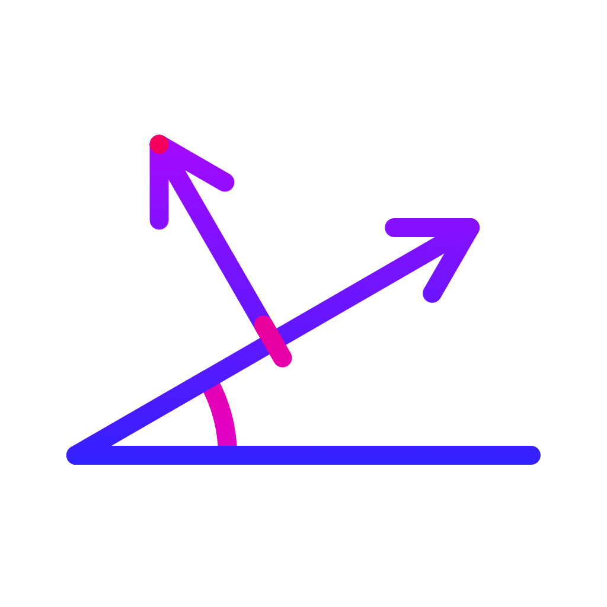

<p align="center">
	<br><br>
	<a href="https://swift.org/package-manager/">
		
	</a>
	<a href="./LICENSE">
		
	</a>
</p>

# CGeometry

###### Simple operators (plus convenient initializers and constants) for CoreGraphics geometric constructs: `CGPoint`, `CGVector`, and `CGSize`.

### Example

```swift
let a = CGPoint(x: 4, y: 7)
print(CGVector(a).length) // 8.06
print(CGVector(a).angle) // 1.05… (~60.3°)

let b = CGPoint(x: 10, y: 3)
print(b - a) // CGVector(dx: 6, dy: -4)
print(a + 0.5 * (b - a)) // CGPoint(x: 7, y: 5)

let offset = CGVector(dx: 10, dy: -5)
print(a + offset) // CGPoint(x: 14, y: 2)
print(a + offset / 2) // CGPoint(x: 9, y: 4.5)

let angled = CGVector(angle: 1/3 * .pi, length: 2)
print(angled) // CGVector(dx: 1, dy: 1.73…)
```

